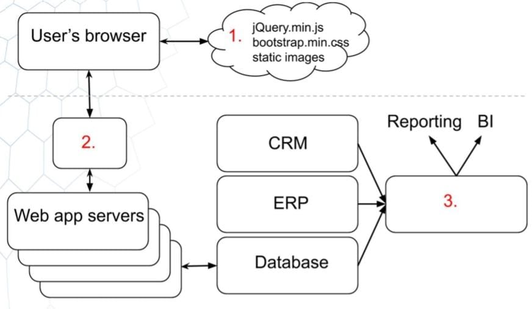

# Question 4 - Section 2

### Statement: 
Someone proposed the following architecture during a brainstorm:

### Question:
The authors of the diagram forgot to write the descriptions for three components marked with red color. Suggests its name and a description for each of the forgotten items. Try to be as accurate as possible.

### Solution

1. CDN: Content Delivery Network is a group of servers spread out over many locations. These servers store duplicate copies of data so that servers can fulfill data requests based on which servers are closest to the respective end-users. CDNs make for fast service less affected by high traffic.
CDNs are used widely for delivering stylesheets and JavaScript files (static assets) of libraries like Bootstrap, jQuery etc. Using CDN for those library files is preferable for a number of reasons:

    * Serving libraries' static assets over CDN lowers the request burden on an organization's own servers.
    * Most CDNs have servers all over the globe, so CDN servers may be geographically nearer to your users than your own servers. Geographical distance affects latency proportionally.
    * CDNs are already configured with proper cache settings. Using a CDN saves further configuration for static assets on your own servers.

2. API Gateways: This module is in charge of distributing in an efficient manner the incoming network traffic to the web app servers. The web app servers are often grouped into the so-called server pools or farms. This ensures that all servers receive requests in such a way that speed and capacity utilization are optimized.

3. Data warehouse: A data warehouse, or enterprise data warehouse (EDW), is a system that aggregates data from different sources into a single, central, consistent data store to support data analysis, data mining, artificial intelligence (AI), and machine learning. A data warehouse system enables an organization to run powerful analytics on huge volumes (petabytes and petabytes) of historical data in ways that a standard database cannot.