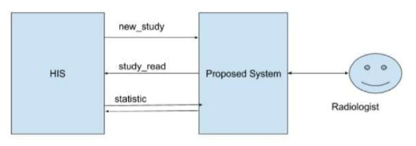
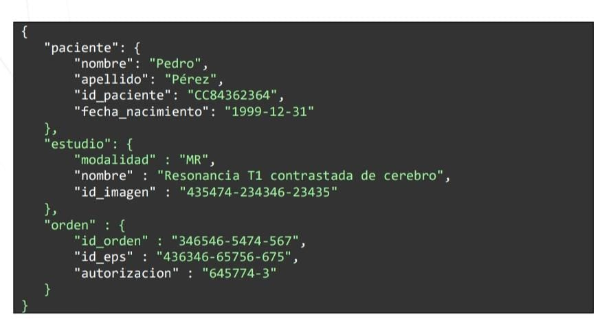
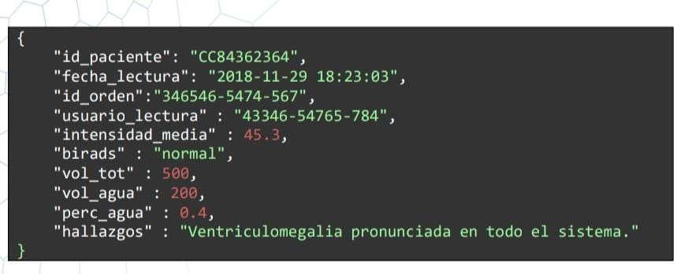
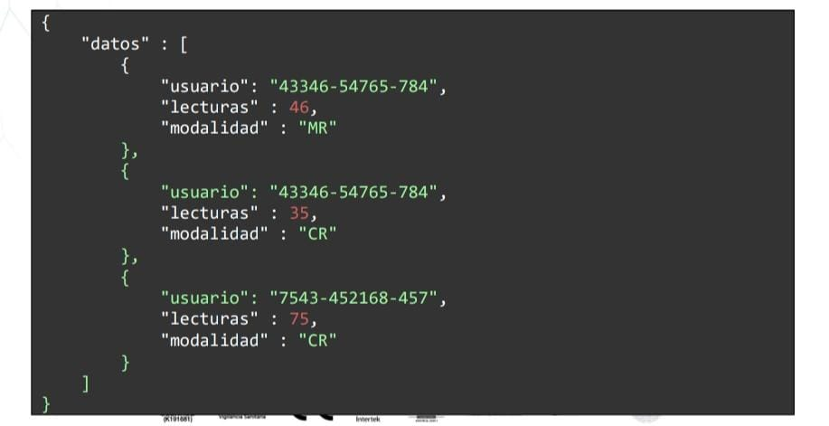
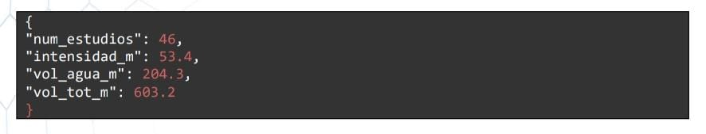

# Question 5 - Section 2

### Statement: 
This point seeks to assess your ability to analyze and solve software design problems. No need to write code, just have a high-level description of the architecture, information flows, storage schema, and decomposition into modules, classes, and functions (which may not all be necessary). Please explain in detail the reasoning that followed to solve the problem. If you require additional information, please ask all the questions you deem necessary.

### Question:
A web system must be implemented to read radiology studies. Radiologists will enter the system and must be able to select pending studies and fill out a form with their findings. The system receives the studies to be performed from the hospital information system (HIS) and must send the results back. Additionally, the HIS will periodically consult statistics on the operation of the reading system. Due to health system regulations, it is not possible to store privileged information as plain text; that is, it must be encrypted:

### New radiological study

When there is a new message to read, HIS will send a JSON message with the following structure:

You must record this information in the system and make it available to radiologists. Please note that patient information cannot be stored as plain text.

### Reading

The system users are radiologists, who will enter to fill out a form with questions about the studies. The workflow should be:

* Authenticate
* See a list of pending studies and choose one • Answer the questionnaire about that study
* Send

You must record the responses along with the date and the user who replied in the system. To respond to users the software needs to have visible:

* Patient's full name
* Patient age
* Study name and modality
* Id
* Image

The questions to answer are:

* Average intensity: number
* Birads Score: Multiple Choice
* Water volume: number
* Total volume: number
* Findings: free text

After filling the two volumes, the system must show the radiologist the percentage of water in the image. That is to say Vwater 100Vtotal

### Read Study

Once the form is submitted, the system must send the information via POST to the HIS, who listens at the URL https://mihis.hospitalcentral.org/apl/completo. For the message to be accepted, an Authorization HTTP header must be included with the value eYjJGCBtJ@Dwd&nEuNHug#dRkp5-G6Ph

The content of the message must be:

### Statistics

As part of a business intelligence system, HIS wants to know the number of studies read by each radiologist and the average time this takes them. To obtain this information, they will make a GET request to an endpoint defined by you with the following parameters:

* Start date: date
* End_date: date
* Modalities: arrangement

To which you must respond with a JSON in the following way:

Also, as part of a scientific study, you want to know the mean intensity and mean volumes for each BIRADS value and each age range. For this, a GET request will be made with the following parameters:

* age min: months (integer)
* age max months (integer)
* BIRADS: string 

The age range is closed-open, for example [18, 24). That is, all studies that at the time of the study have an age in months greater than or equal to the minimum age and strictly less than the maximum age will be included.

To which you should respond with a JSON of the form

### Solution

| ID DE HISTORIA DE USUARIO | Como  <tipo de usuario> | Quiero  <realizar alguna tarea> | para que pueda  <el logro algún objetivo>            |
|---------------------------|-------------------------|---------------------------------|------------------------------------------------------|
| 1                         | Radiologys              | Enter the system                | Tener acceso a la plataforma                         |
| 2                         | Radiologys              | New study                       | Crear un nuevo estudio                               |
| 3                         | Radiologys              | Read study                      | leer los estudios                                    |
| 4                         | System                  | Generar notificaciones          | Cuando HIS envie informacion estar enterado          |
| 5                         | System                  | Leer el JSON                    | Tener toda la informacion                            |
| 6                         | System                  | Guardar JSON                    | Poner a disposicion la informacion a los radiologos  |
| 7                         | System                  | Responder enviado a HIS         | Generar las estadisticas de tiempos de atencion      |

### Case of use
  

  
